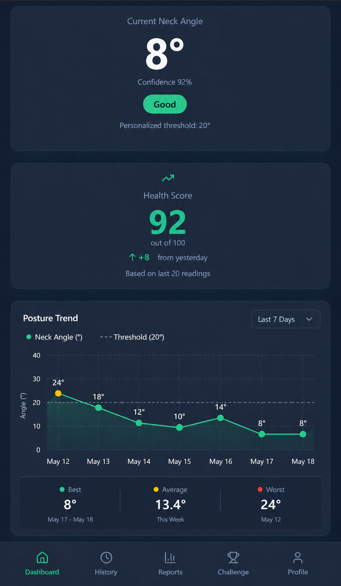
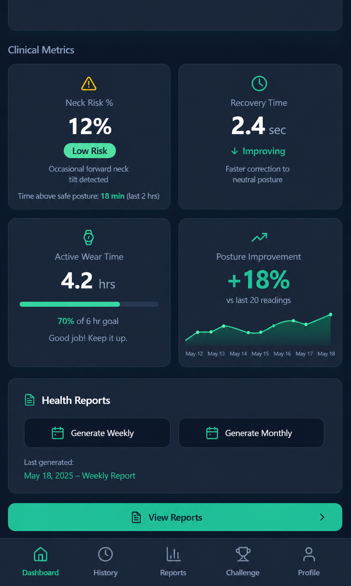
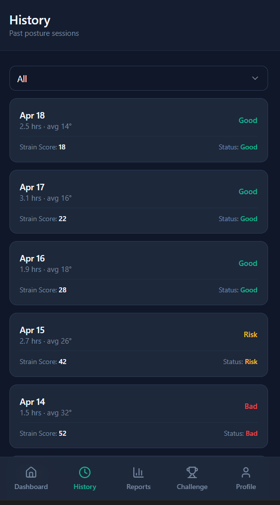
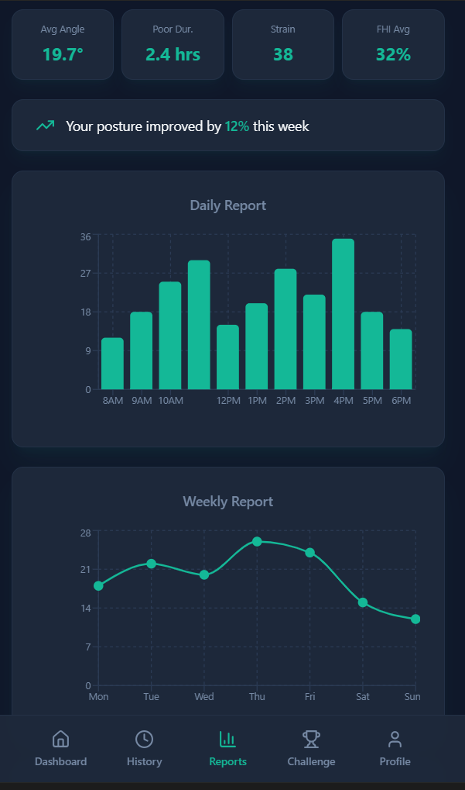
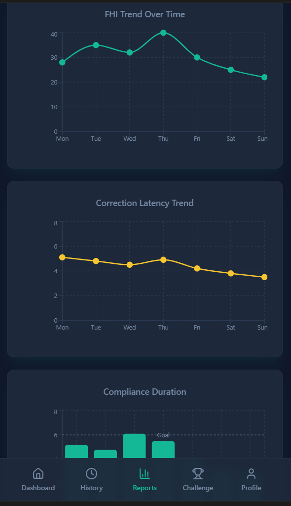
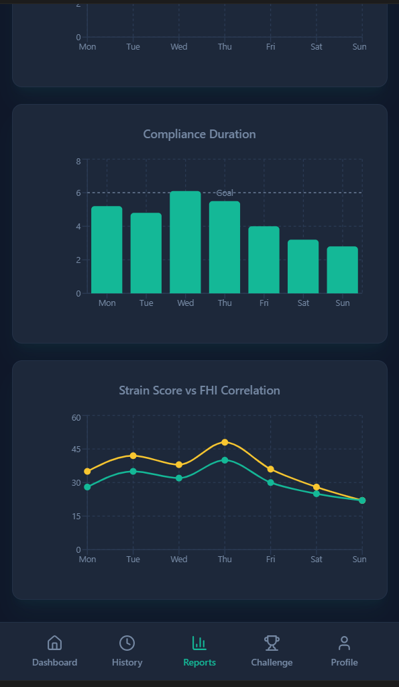

<p align="center">
  
</p>

<h1 align="center">CerviSense</h1>

<p align="center">
Wearable Cervical Spine Monitoring System with Real-Time Posture Feedback
</p>

---

## Overview

CerviSense is a wearable biomedical system designed to monitor cervical spine posture in real time using motion sensing and embedded processing. The system tracks neck orientation during daily activities and provides immediate feedback to help prevent poor posture habits.

This project focuses on accessible, continuous monitoring outside clinical environments, enabling early correction and long-term posture improvement.

---

## Why CerviSense?

Modern lifestyles involving prolonged smartphone and computer usage have led to a rise in cervical posture disorders. Traditional assessment methods rely on periodic clinical observation and lack continuous monitoring.

CerviSense addresses this by providing real-time posture tracking and feedback using wearable sensing, enabling users to detect and correct poor posture during everyday activities.

---

## System Architecture


### Hardware Components

- **Microcontroller**: ESP32 (real-time data acquisition, processing, and wireless communication)  
- **Motion Sensor**: MPU6050 (6-axis IMU for cervical pitch and roll tracking)  
- **Wearable Design**: Neck-mounted ergonomic device for continuous posture monitoring  
- **Feedback Module**: Vibration-based alert system for real-time posture correction  

---

### Software Stack

- **Embedded Firmware**: C/C++ (Arduino framework, PlatformIO – VS Code)  
- **Frontend Interface**: React + TypeScript dashboard for real-time visualization  
- **Styling**: Tailwind CSS for responsive UI design  
- **Backend**: Supabase for cloud storage and data management  

---

### Data Flow

IMU (MPU6050) → ESP32 → Wi-Fi → Supabase → Dashboard → User Feedback  

The ESP32 continuously acquires cervical motion data, applies calibration and filtering, and transmits processed posture data to the cloud. The dashboard visualizes posture metrics and generates real-time feedback for the user.

---

## System Workflow

1. **Sensor Acquisition**: MPU6050 captures neck orientation (pitch & roll) in real time  
2. **Calibration & Filtering**: Sensor bias correction and noise filtering applied  
3. **Posture Analysis**: Threshold-based classification of normal vs. poor posture  
4. **Feedback Generation**: Real-time alert (vibration/notification) for posture correction  
5. **Data Transmission**: Processed data sent to backend (Supabase)  
6. **Visualization**: Dashboard displays posture trends, metrics, and user insights  

---

## UI Preview

The CerviSense dashboard provides real-time visualization of cervical posture, health metrics, and user engagement data.

### Core Monitoring Interface

- **Current Neck Angle**: Real-time pitch angle measurement with confidence level  
- **Health Score**: Composite score (0–100) based on posture quality  
- **Posture Trend**: Continuous tracking of posture variations over time  

---

### Clinical Metrics

- **Neck Risk (%)**: Percentage indicating time spent in unsafe posture  
- **Recovery Time**: Time required to return to neutral posture  
- **Active Wear Time**: Duration of device usage  
- **Posture Improvement**: Progress comparison across sessions  

---

### Analytics & Reports

- **Daily Report**: Hourly posture distribution visualization  
- **Weekly Report**: Trend-based posture analysis  
- **Strain Score**: Quantification of posture stress levels  
- **Session History**: Log of posture sessions with status classification (Good / Risk / Bad)  

---

### User Engagement Features

- **Posture Challenges**: Gamified tracking (monthly goals, streaks, badges)  
- **Achievements System**: Rewards for maintaining good posture habits  
- **Personalization Insights**: Adaptive posture thresholds based on user data  

---

## Dashboard Screens

<div style="display:flex; overflow-x:auto; gap:12px; padding:10px 0;">

  
  
  
  
  
  

</div>

## AI Integration (In Progress)

The system is designed for machine learning–based posture classification.

Planned:
- Random Forest / ML-based posture classification  
- Personalized posture correction recommendations  
- Adaptive threshold learning  

---

## Biomedical Applications

- Real-time cervical posture monitoring  
- Prevention of neck strain and musculoskeletal disorders  
- Workplace ergonomics improvement  
- Rehabilitation and posture correction support  

---

## Future Scope

- Machine learning-based posture classification  
- Mobile application development  
- Clinical validation studies  
- Advanced wearable miniaturization  

---

## Disclaimer

This project is developed as a biomedical engineering prototype. AI components are under development and not fully integrated.

---

## Getting Started

### Prerequisites

- Node.js (v18 or higher) and npm installed ([install with nvm](https://github.com/nvm-sh/nvm#installing-and-updating))
- Git for version control
- ESP32 development board and MPU6050 IMU sensor
- USB cable for ESP32 programming

---

### Installation & Setup

#### Clone the Repository

```sh
git clone https://github.com/Ruben-Samuel-S/cervisense.git
cd cervisense
```

#### Install Frontend Dependencies

```sh
npm install
```

#### Start Development Server

```sh
npm run dev
```

The dashboard will launch in your browser with hot-reload enabled.

#### Build for Production

```sh
npm run build
```

---

## Contributing

Contributions, bug reports, and feature suggestions are welcome. Please open issues or submit pull requests to help improve the system.

---

## License

This project is provided for educational and research purposes. Consult relevant regulatory bodies and medical device regulations for clinical or commercial applications.

---

## Contact

For technical questions, collaboration inquiries, or feedback, please reach out through GitHub issues or contact the project maintainers.

---

**Last Updated**: April 2026  
**System Status**: Functional Prototype with Real-Time Data Acquisition, Visualization, and Mechanical Validation
