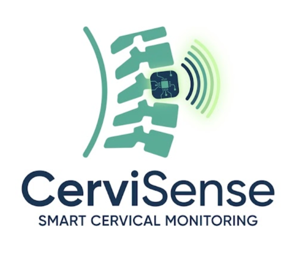
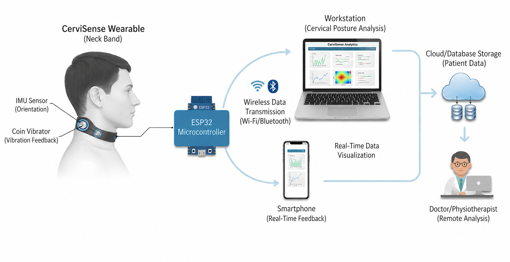

  

<h1 align="center">CerviSense</h1>

Wearable Cervical Spine Monitoring System with Real-Time Posture Feedback

---

## Overview

CerviSense is a wearable biomedical system designed to monitor cervical spine posture in real time using motion sensing and embedded processing. The system tracks neck orientation during daily activities and provides immediate feedback to help prevent poor posture habits.

This project focuses on accessible, continuous monitoring outside clinical environments, enabling early correction and long-term posture improvement.

---

## Why CerviSense?

Modern lifestyles involving prolonged smartphone and computer usage have led to a rise in cervical posture disorders. Traditional assessment methods rely on periodic clinical observation and lack continuous monitoring.

CerviSense addresses this by providing real-time posture tracking and feedback using wearable sensing, enabling users to detect and correct poor posture during everyday activities.

---

## System Architecture

### Hardware Components
- ESP32 microcontroller (data acquisition & processing)
- MPU6050 IMU (neck orientation tracking)
- Wearable form factor (neck-mounted device)

### Software Stack
- Embedded C/C++ (ESP32 firmware)
- React dashboard / mobile interface
- Tailwind CSS (UI)
- Supabase (backend data storage)

### Data Flow
IMU → ESP32 → Wi-Fi → Supabase → Dashboard → Feedback

---

## System Workflow

1. IMU captures neck orientation (pitch & roll)
2. Sensor calibration and filtering
3. Posture classification (basic threshold / AI-ready logic)
4. Feedback generation (alert system)
5. Data storage and visualization

---

## Key Features

- Real-time posture monitoring  
- Pitch & roll tracking of cervical movement  
- Alert system for poor posture detection  
- Continuous wearable operation  
- Data visualization dashboard  

---

## AI Integration (In Progress)

The system is designed for machine learning–based posture classification.

Planned:
- Random Forest / ML-based posture classification  
- Personalized posture correction recommendations  
- Adaptive threshold learning  

---

## My Contributions

- Integrated MPU6050 IMU for cervical motion tracking  
- Developed ESP32-based data acquisition and processing  
- Designed wearable system for continuous monitoring  
- Implemented posture detection and alert logic  
- Built visualization interface for posture analysis  

---

## Biomedical Applications

- Cervical posture monitoring  
- Prevention of neck strain and musculoskeletal disorders  
- Workplace ergonomics improvement  
- Rehabilitation support  

---

## Future Scope

- ML-based posture classification  
- Mobile app integration  
- Clinical validation studies  
- Advanced wearable miniaturization  

---

## Disclaimer

This project is developed as a biomedical engineering prototype. AI components are under development and not fully integrated.

---
